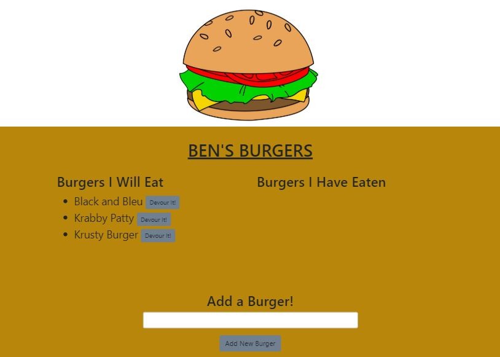

# BurgerDecider
  
  ## Description 
      This application is a fun way to keep track of burgers you would like to eat, or have eaten already!
## Table of Contents
1.[Usage](#Usage)
2.[Contribution](#Contribution)
3.[Questions](#Questions)

## Usage
    This project was an excellent way to work on using Handlebars, and well as mySQL databases for practical applicaitons 
## Installation Requirements
    This Apllication requires npm packages handelbars, mysql, and express.            
## Contribution 
    Please contact Ben de Garcia to work on future iterations.
## Questions
  
If you have questions, contact me at [GitHub](https://github.com/bdegarcia).